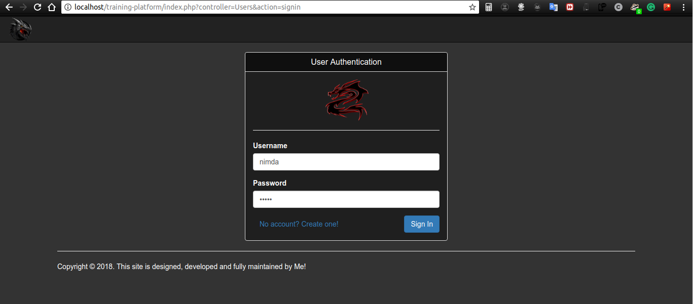
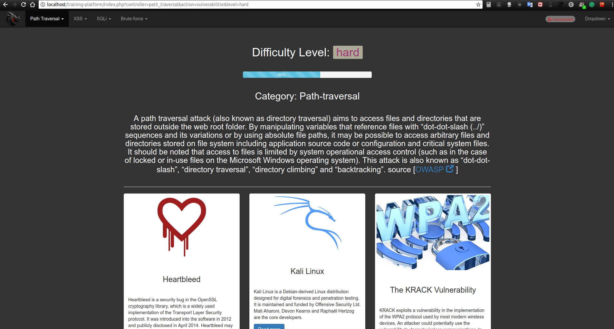
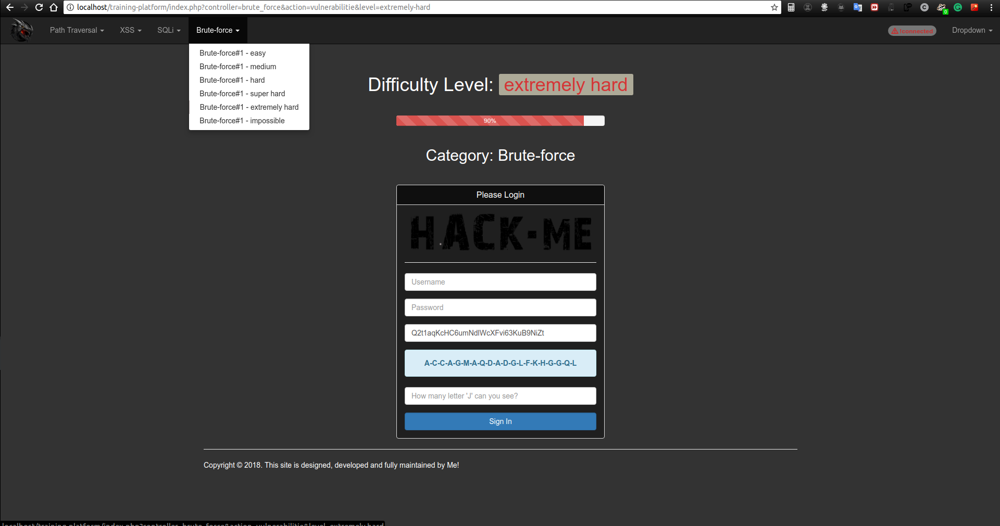

# Training-platform for web application security
# Docker commands
Cd to the project folder and run these commands
```
docker build --tag trp:1.0 . 
docker run -it --name trpc --rm -p 80:80 --mount type=bind,source=$(pwd),destination=/var/www/html trp:1.0
```
## Requirements
- Apache webserver
- Mysql database
- Computer :)

## Installation
- download zip file or git clone https://github.com/bichiko/training-platform.git
- Start apache + mysql
- Just run from your favorite browser
- It will ask your Database user and password. User by default is root and password could be blank as well but better to know your DB pass. Write password, submit form and you are done! 





